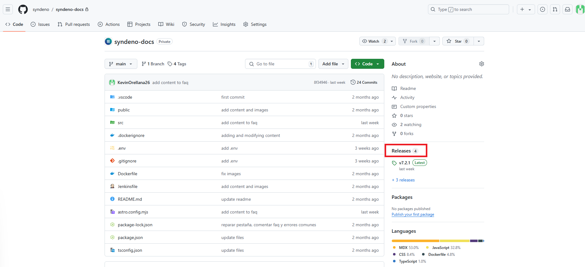
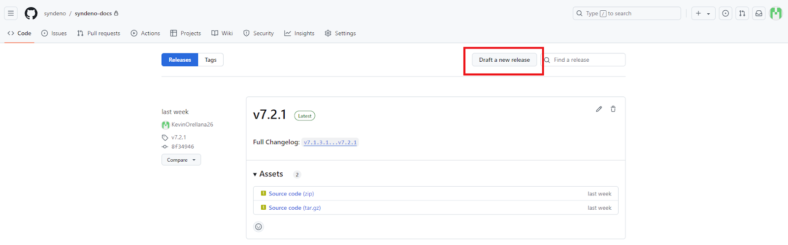
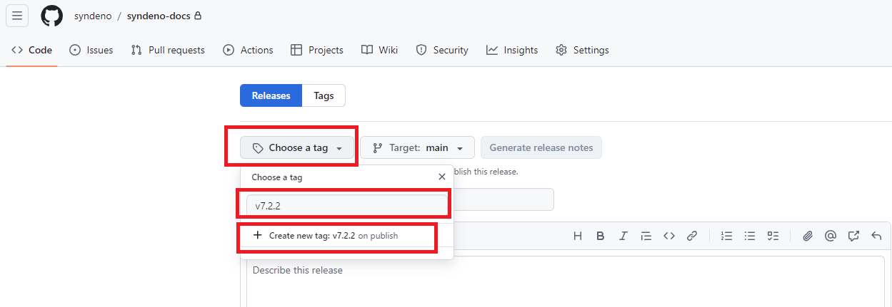
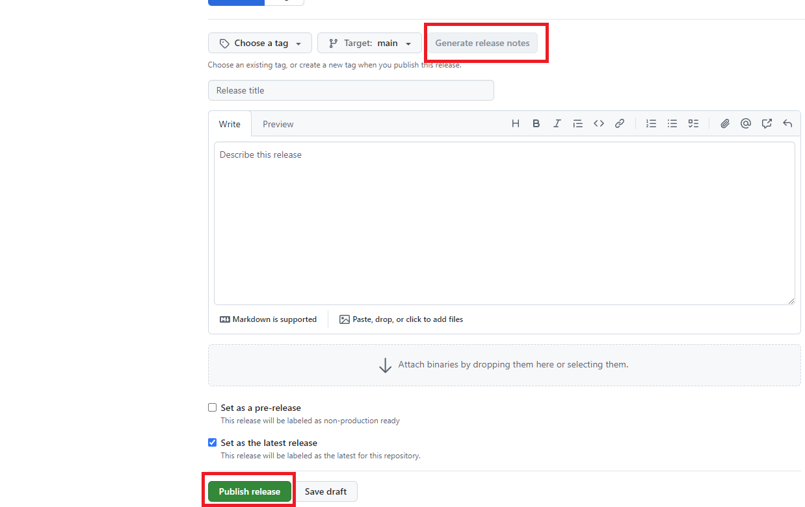
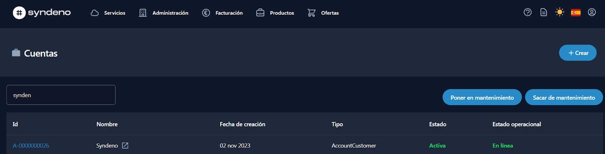
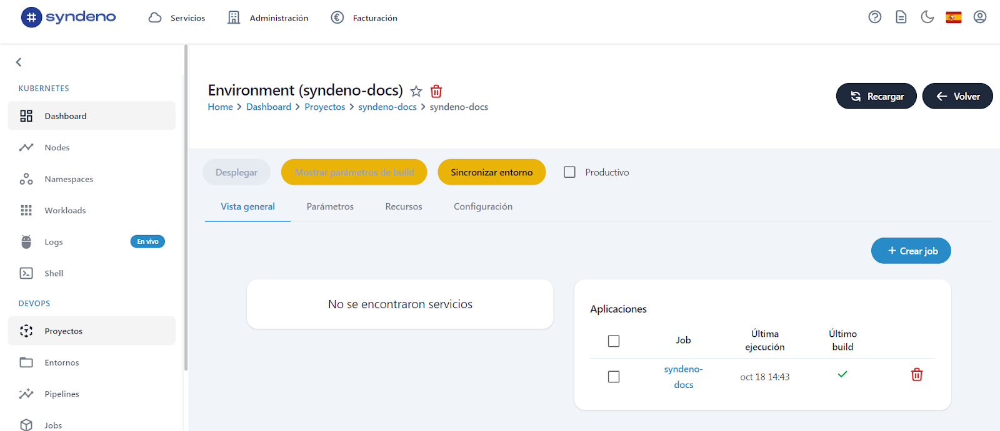
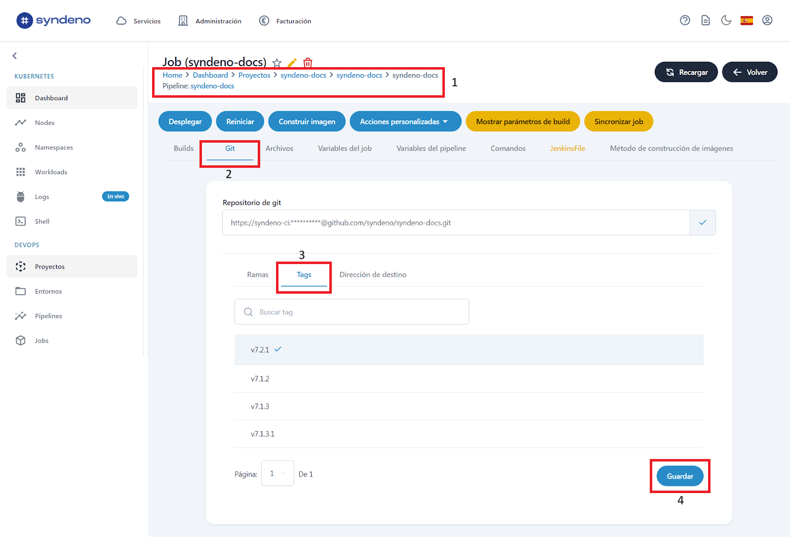
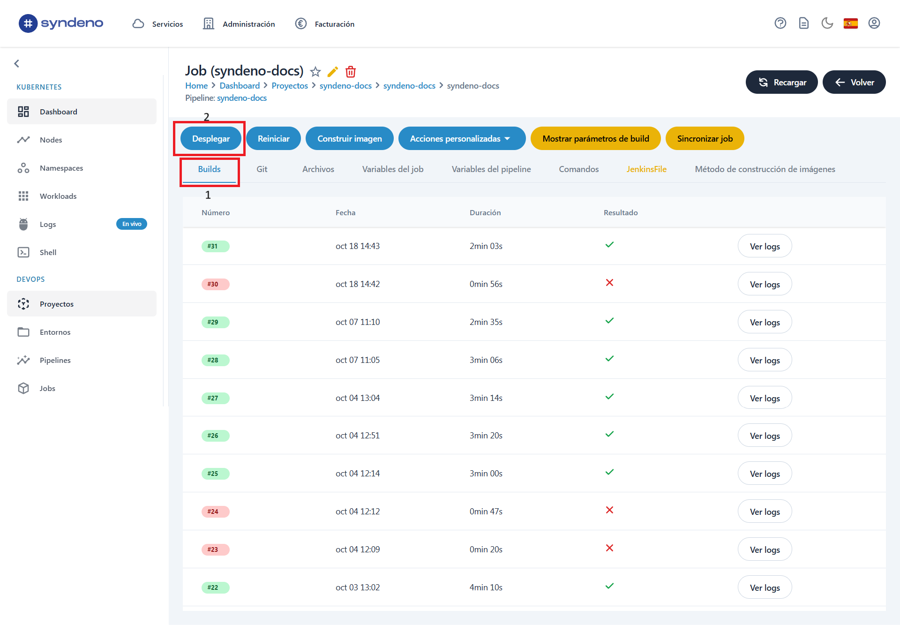

# Syndeno Docs

Esta es una guía paso a paso de cómo se pueden añadir nuevas páginas, hacer pruebas en local y los pasos que tienes que seguir para poder hacer publicaciones para personas sin previo conocimiento técnico.

**Conceptos:**
* **Astro:** es un framework de JavaScript que genera todo el contenido estático cuando pasa por el proceso de compilación.
* *Compilación:* significa el código que hacemos, lo transformamos a código que entienden las máquinas.

---

## Índice
- [Instalar node](#instalar-node)
- [Instalar y Configurar Git](#instalar-y-configurar-git)
- [Instalar Visual Studio Code](#instalar-visual-studio-code)
- [Atajos de estilos MarkDown](#atajos-de-estilos-markdown)
- [Puntos más importantes](#puntos-más-importantes)
- [Añadir una nueva página](#añadir-una-nueva-pagina)
- [Añadir página en el fichero astro.config.mjs](#añadir-página-en-el-fichero-astroconfigmjs)
- [Crear release](#crear-release)
- [Resumen](#resumen)
- [Comandos](#comandos)

---
### Instalar node
Los siguientes pasos detallan cómo instalar tanto **node.js** como **npm** (node package manager), que es necesario para manejar dependencias en proyectos.

#### Pasos para descargar e instalar Node.js en Windows:

1. Descargar el instalador de Node.js: [Node.js](https://nodejs.org/)
2. Estando en la página oficial, descarga la versión “lts” (Long Term Support), es más estable y recomendada.
   


4. Sigue los pasos del instalador, aceptando los términos y seleccionando las opciones por defecto. 
5. Verifica la instalación:
   * Desde una terminal o powershell ejecutar: ```node -v``` y ```npm -v```

---
### Instalar y Configurar Git

1. Instalar Git:
   - Si aún no tienes Git instalado, puedes descargarlo desde [git](https://git-scm.com/downloads) y seguir las instrucciones para tu sistema operativo.

2. Configurar tu usuario de Git
Previamente debes crear una cuenta en GitHub si aún no la tienes. 
Teniendo la cuenta creada, desde la terminal puedes ejecutar los siguientes comandos:

```bash
git config --global user.name "NombreGit"
git config --global user.email "tu-email@example.com"
```

#### Clonar repositorio
1. Clona el repositorio desde Git usando la terminal:

   ```git clone https://github.com/syndeno/syndeno-docs.git```

2. Muévete a la carpeta

   ```cd syndeno-docs/```

3. Instalar las dependencias del proyecto (esto descargará todas las dependencias del archivo package.json)

   ```npm install```

4. Ejecutar el servidor en local

   ```npm run dev```

5. Acceder al navegador

   ```http://localhost:4321```

6. Ver cambios en tiempo real. El servidor estará observando los cambios que hagas en los archivos. Cuando edites algún archivo, el navegador se actualizará automáticamente para reflejar los cambios.

### Instalar Visual Studio Code

Lo puedes instalar desde la miscrosofts store o desde la propia página oficial: [descargar](https://code.visualstudio.com/download)

### Atajos de estilos MarkDown

Usa este [enlace](https://markdown.es/sintaxis-markdown/) para ver como utilizar MarkDown.

---
### Puntos más importantes

1. El archivo más importa **astro.config.mjs**
   - Starlight es un tema o integración dentro de astro. Dentro de Starlight definimos el **título, las redes sociales, idioma, y el sidebar**. 
   - Dentro del fichero *astro.config.mjs*:
     - **Sidebar**: es la sección en donde podrás añadir las páginas y verlas en el sidebar.
     - **Label**: es el título que nosotros veremos en la documentación. Y es la categoría que agrupa al resto de guías.
     - **Ítems**: todas las guías que meteremos dentro de una categoría.
     - **Collapsed: true | false**. Es para que se abra o cierre el label padre si contiene labels hijos. Ejemplo:
      

2. **Slug**: es la URL en donde se encuentra el archivo.md. Dependiendo de donde se encuentre. Todo lo que pongamos en la carpeta **/docs** astro lo va a referenciar como rutas.
3. Fichero **index.mdx:** es el primer fichero que se muestra en la documentación.
4. Ficheros **.md y .mdx**.
   * Es markdown. Las 4 primeras líneas es metadata de HTML donde le pasamos el título y en algunas ocasiones la tabla de contenidos dentro de la página.
   * El resto es markdown. Algunos ficheros serán .mdx donde le decimos que vamos a añadir algunos componentes.
5. Añadir estilos en la carpeta **/styles/custom.css**.
6. Añadir imágenes en la carpeta **/img**.
7. Versionado y despliegue.

---

### Añadir una nueva página
Para añadir una nueva página tienes que estar dentro de la siguiente dirección: 
```syndeno-docs/src/content/docs/[nombre-carpeta]/[nombre-fichero].md```

Y ahí añadimos el contenido deseado. La estructura de un ```fichero.md``` es el siguiente:
```
–--
Title: “titulo1”
tableOfContents: false | true -> (Si no quieres mostrar la tabla de contenidos dentro de esa página).
–--

# -> Es para los títulos. Es el H1, si queremos un H2 es ##, y así sucesivamente hasta H6.
**texto** -> Es para poner en negrita el texto.
*texto* -> Es para poner en itálica el texto.
1 -> Es para añadir una lista numerada.
* -> Es para añadir una lista.
```

Ten en cuenta que el ```fichero.md``` se le pueden pasar bloques HTML. Para añadir una imagen utiliza la siguiente estructura:

```
<br><br>
<a href="/src/content/docs/img/[dir]/[dir]/[img].png" target="_blank">
    
</a>

<br>
```

Se debería ver de la siguiente manera:
```
<br><br>
<a href="/src/content/docs/img/faq/crear-archivos/pestana-archivos.png" target="_blank">
    
</a>

<br>
```

Si queremos añadir enlaces a otra página de la documentación:
```[Acceso a Logs](https://docs.syndeno.cloud/how-to/visualizar-logs/pod-unico-contenedor/)```

> **Nota:** Tienes que poner la ruta en donde se encuentra el fichero. Se tiene que poner docs.syndeno.cloud para mostrar la página que está en producción.

Añadir enlaces externos:
```[Syndeno Platform](https://syndeno.cloud/sign-in)```

---

### Añadir página en el fichero astro.config.mjs
```
{
  label:
      "[nombre-de-la-página]",
  slug: "[ruta-del-fichero]", 
},
```
> ⚠️**Cuidado:** Ten en cuenta que en el slug no tienes que poner la extensión del fichero. 
Y el nombre que pongas en la label es el nombre que aparecerá en el sidebar.

Ejemplo de como sería:
```
{
  label:
      "¿Qué hacer cuando falla un Pipeline?",
  slug: "common-errors/error-falla-pipeline",
},
```

---

### Subir los cambios al repositorio
Teniendo los documentos generados y probados en local. Estamos listos para pasar a producción. 
Los pasos son los siguientes:
1. ```git status``` muestra las diferencias entre ficheros/directorios entre lo que está en el repo y lo que tienes en local.
2. ```git add``` añade todo lo que tienes en local (asegúrate de que sean los ficheros/directorios que desees subir al repositorio).
3. ```git commit -m "mensaje"``` añade un mensaje corto de cuál es el cambio que has hecho. 
4. ```git push origin [rama]``` Sube los cambios al repositorio. En este caso [rama] es main. 

---

### Crear release
> **Nota:** Una *release* es el contenido actual que hay en el repositorio y lo convierte en un .zip

Ten en cuenta de que el nombre de la release tiene que ser la versión de la documentación (v0.0.0). 

Para crear una nueva release sigue los siguientes pasos:

1. Accede a la sección *Releases*:


2. Una vez accedes a *"Releases"* creas una nueva release pulsando el botón  *"Draft a new release"*:


3. Una vez dentro, pulsa *"Choose a tag"* y crea una nueva tag y pulsa *"create a new tag: [tag] on publish"*


4. Teniendo eso, pulsamos el botón *"Generate release notes"* y después pulsamos *"Publish Release"*


Esto creará una nueva release con el tag que le has asignado. 

> **Nota:** El nombre que le has dado a la tag, es el que se utilizará para el versionado de la documentación.

---

### Desplegar nueva versión desde la plataforma
Para desplegar una nueva versión de Syndeno Docs desde la plataforma sigue los siguientes pasos:

1. Accede a la subcuenta de Syndeno:
   

2. Accede al proyecto y entorno de nombre *"syndeno-docs"*
   

3. Accede a la aplicación y ve a la pestaña ***"Git"***. Dentro de esa pestaña, abre la pestaña ***"Tags"*** para ver las releases que hay en el repositorio y selecciona la que has creado. 
   
4. Con la tag seleccionada, ve a la pestaña ***"Builds"*** y pulsamos el botón Desplegar.
   

--- 

### Resumen

Estructura del proyecto: 

```
.
├── public/
├── src/
│   ├── assets/
│   ├── content/
│   │   ├── docs/
|   |   |   ├── img/
│   │   └── config.ts
│   └── env.d.ts
├── astro.config.mjs
├── package.json
└── tsconfig.json
```

### Comandos

| Comando                   | Acción                                           |
| :------------------------ | :----------------------------------------------- |
| `npm install`             | Instala las dependencias.                        |
| `npm run dev`             | Inicia el servidor local en`localhost:4321`.     |
| `npm run build`           | Construye la web de producción en `./dist/`.     |
| `npm run preview`         | Previsualizas como se vería en un "pre-producción" sin desplegar. |
| `npm run astro ...`       | Corre comandos como `astro add`, `astro check` |
| `npm run astro -- --help` | Para mostrar la ayuda de astro desde la terminal.                     |
